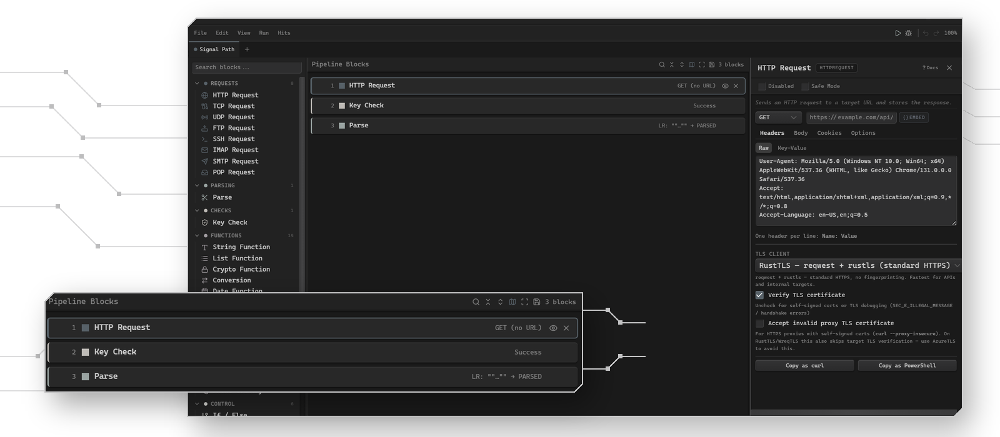

<div align="center">


<h1>Ironbullet</h1>

**Bullet Software made with love**

[](https://github.com/notgate/Ironbullet/releases/latest)
[](https://github.com/notgate/Ironbullet/releases)
[](LICENSE)
[](https://notgate.github.io/Ironbullet/)

</div>

<p align="center">
  <picture>
    <source media="(prefers-color-scheme: dark)" srcset="docs/media/ironbullet-hero-dark.png">
    <source media="(prefers-color-scheme: light)" srcset="docs/media/ironbullet-hero-light.png">
    
  </picture>
</p>

---

Ironbullet is a desktop automation toolkit built around a visual, drag-and-drop pipeline editor. Chain together supported blocks for HTTP requests, parsers, checks, transformations, browser automation, and protocol clients, then run them against authorized datasets with multi-threaded job execution.

## Features

| | |
|---|---|
|  **Block pipeline editor** | Drag-and-drop interface with 50+ block types across 8 categories |
|  **Debug mode** | Step-through execution with live request/response viewer and variable inspector |
|  **Multi-threaded jobs** | Configurable thread pools, proxy rotation, ban detection, gradual ramp-up |
|  **Intellisense** | Context-aware autocomplete in all input fields — variables, headers, delimiters, response body predictions |
|  **TLS fingerprinting** | AzureTLS, RustTLS, and WreqTLS backends with per-block JA3/HTTP2 fingerprint control |
|  **MITM capture** | Built-in proxy captures browser traffic for Site Inspector — export as JSON/HAR |
|  **Code export** | Export any pipeline as standalone Rust source code |
|  **Plugin system** | Hot-loadable plugins extend the block palette without recompiling |
|  **OB2 import** | Import OpenBullet 2 / SilverBullet configs (.svb, .opk, .loliScript) |

## Installation

Download the latest release for your platform:

| Platform | File |
|---|---|
| Windows | `ironbullet-vX.X.X-windows-x64.zip` |
| Linux | `ironbullet-vX.X.X-linux-x64.zip` or `.AppImage` |

Extract and run `ironbullet` (or `ironbullet.exe`). The sidecar binary (`reqflow-sidecar` / `reqflow-sidecar.exe`) must be in the same directory.

> **Linux users:** The published `.zip` bundle includes `ironbullet`, `reqflow-sidecar`, and `start.sh`; install `webkit2gtk-4.1` (or the compatible 4.0 package on older distributions) before launching it. An AppImage should only be used when a matching one is explicitly attached to that release.

## Quick Start

1. Launch Ironbullet
2. Add blocks from the left palette or press **Ctrl+K**
3. Click a block to open its settings in the right panel
4. Press **F5** to run a debug test with a single data line
5. Open the **Response Viewer** to inspect HTTP traffic
6. Create a **Job** to process a full wordlist with multiple threads

## Block Categories

<details>
<summary><b>HTTP</b> — Requests with full header/cookie/body control</summary>

- `HttpRequest` — Send configurable HTTP requests via AzureTLS, RustTLS, or WreqTLS
- Custom headers, cookies, and form/raw request bodies
- Per-request JA3, HTTP/2 fingerprint, proxy, and browser profile overrides

</details>

<details>
<summary><b>Parsing</b> — Extract data from responses</summary>

- `ParseLR` — Left/right delimiter extraction
- `ParseJSON` — JSON path (dot notation)
- `ParseRegex` — Regular expression with capture groups
- `ParseCSS` — CSS selector + attribute extraction
- `ParseXPath` — XPath queries
- `ParseCookie` — Extract specific cookie values

</details>

<details>
<summary><b>Functions</b> — Transform and compute</summary>

- `StringFunction` — Replace, trim, encode/decode, split, random string
- `CryptoFunction` — MD5, SHA1/256/512, HMAC, BCrypt, AES
- `ConversionFunction` — Type casts, Base64, Hex, URL, bytes, BigInt
- `DateFunction` — Format, parse, add/subtract time, Unix timestamp
- `JwtToken` — Sign and verify HS256/384/512 JWTs
- `HeaderSpoof` — Inject randomized forwarding IP headers

</details>

<details>
<summary><b>Control</b> — Flow and logic</summary>

- `IfElse` — Conditional branching
- `Loop` — Iterate over lists or repeat N times
- `SetVariable`, `CaseSwitch`, and `Delay`

</details>

<details>
<summary><b>Browser</b> — Headless automation</summary>

- Open, navigate, click, type, wait, screenshot, execute JS
- Cookie and session management

</details>

<details>
<summary><b>Protocols</b> — Raw network clients</summary>

- TCP, UDP, FTP, SSH, IMAP, SMTP, POP3

</details>

<details>
<summary><b>Bypass</b> — Anti-bot handling</summary>

- `CaptchaSolver` — Integrate third-party solver APIs
- `CloudflareBypass` — FlareSolverr integration
- `LaravelCsrf` — Auto-fetch CSRF tokens

</details>

<details>
<summary><b>Utilities</b></summary>

- `Log`, `Webhook`, `CookieContainer`, `FileSystem`, `Plugin`

</details>

## Build from Source

**Requirements:** Rust 1.80+, Node.js 20+, Go 1.23+

```bash
git clone https://github.com/notgate/Ironbullet.git
cd Ironbullet

# 1. Build the frontend
cd gui && npm install && npm run build && cd ..

# 2. Build the sidecar
cd sidecar && go build -o reqflow-sidecar && cd ..

# 3. Build the app
cargo build --release
```

The binary is at `target/release/ironbullet`. Copy it alongside `reqflow-sidecar` to run.

**Cross-compile for Windows (from Linux):**
```bash
cargo build --release --target x86_64-pc-windows-gnu
```

## License

MIT — see [LICENSE](LICENSE) for details.
